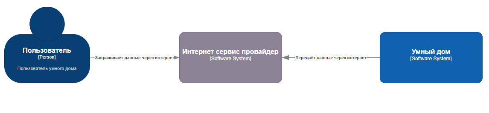

# Архитектурная Ката

## Свет, пожалуйста

Гигант в сфере бытовой электроники хочет создать систему для автоматизации дома: включение и выключение света, запирание и отпирание дверей, удаленное наблюдение с помощью камер и неопределенное поведение в будущем.

- Пользователи: каждая система будет продаваться потребителям (небольшим семьям), но компания рассчитывает продать тысячи таких устройств в течение первых трех лет.
- Требования:
  - система должна быть максимально готова к эксплуатации, но при этом продаваться в модульных блоках (камера, замок, термостат и т. д.) для удобства покупки
  - устройства должны быть доступны через Интернет (для удаленного мониторинга и доступа), и предполагается, что у пользователя будет существующая настройка WiFi (маршрутизатор и подключение) для подключения
  - клиенты могут программировать систему для управления различными модулями в соответствии со своими потребностями.
  - электротехникой для блоков займутся другие группы, а программные протоколы для управления модулями будут гибкими в соответствии с потребностями/проектами вашей архитектуры. (Они займутся реализацией модульной части протокола, как только вы им это укажете.)
- Дополнительный контекст:
  - готов инвестировать большую сумму, чтобы запустить это новое направление бизнеса
  - собирает данные от клиентов, которые согласились собирать более широкую статистику
  - международная компания

## Бизнес-цели и бизнес-драйверы

    1. Выход на международный уровень
    2. Продажа нескольких тысяч в течение 3 лет
    3. Доступность для небольших семей

## Стейкхолдеры и их потребности

    1. Выход на международный уровень
    2. Продажа нескольких тысяч в течение 3 лет
    3. Готовность инвестировать большую сумму

## Пользовательские истории

    1. Пользователь должен иметь возможность удалённо включать\выключать свет.
    2. Пользователь должен иметь возможность удалённо отпирать\запирать двери.
    3. Пользователь должен иметь возможность производить удаленное наблюдение с помощью камер видеонаблюдения.

## Атрибуты качества (и не функциональные требования)

    1. Исполнение в виде готовых модулей
    2. Доступ через wi-fi для каждого модуля
    3. Поддержка пользовательских сценариев
    4. Поддержка стандартных протоколов
    5. Многоязыковая поддержка

## Изобразите контекстную схему системы

## Критические сценарии и критические характеристики

    1. Безопасность передачи данных из умного дома
    2. Безопасность хранения данных
    3. Безопасность самого умного дома
    4. Безопасность эксплуатации
    5. Безопасность взаимодействия с детьми \ животными
    6. Лёгкая настройка для пользователя

## 2 первых архитектурных решения запишите в виде ADR

### ADR-001 Электропитание устройств умного дома

#### Статус

Принято

#### Контекст

Устройства работают от электрического тока, необходимо решить, насколько они могут быть автономными, одновременно с этим решить вопросы безопасности устройств при взаимодействии с пользователями.

#### Решение

Основную группу устройств:
Замки, камеры, переключатели освещения

- не снабжать аккумуляторами.
- Электропитание будет производиться от сети постоянного тока 5В, через внешний блок питания
- Использовать стандартизированные гнезда\разъемы usb type-c

#### Последствия

- Унификация устройств питания для устройств умного дома
- Безопасное для человека, животных напряжение питания
- Уменьшение размеров устройств из-за отказа от аккумуляторных батарей

### ADR-002 Обмен данными между умным домом и пользователем

#### Статус

Принято

#### Контекст

Устройства умного дома подключены к сети интернет. Необходимо организовать безопасную передачу данных между пользователем и умным домом, определить направление потока данных.

#### Решение

Снаружи сети интернет сетевое оборудование не будет принимать запросы для обеспечения безопасности. Устройства сами будут выходить в сеть интернет и запрашивать список задач \ команд для выполнения. Для этого необходимо будет создать отдельный безопасный интернет-сервис, к которому будут подключаться устройства и будет подключаться пользователь.

#### Последствия

- Безопасное взаимодействие между умным домом и пользователем.
- Необходимо разрабатывать сервис
- Необходимо разрабатывать клиентское приложение для доступа к управлению
