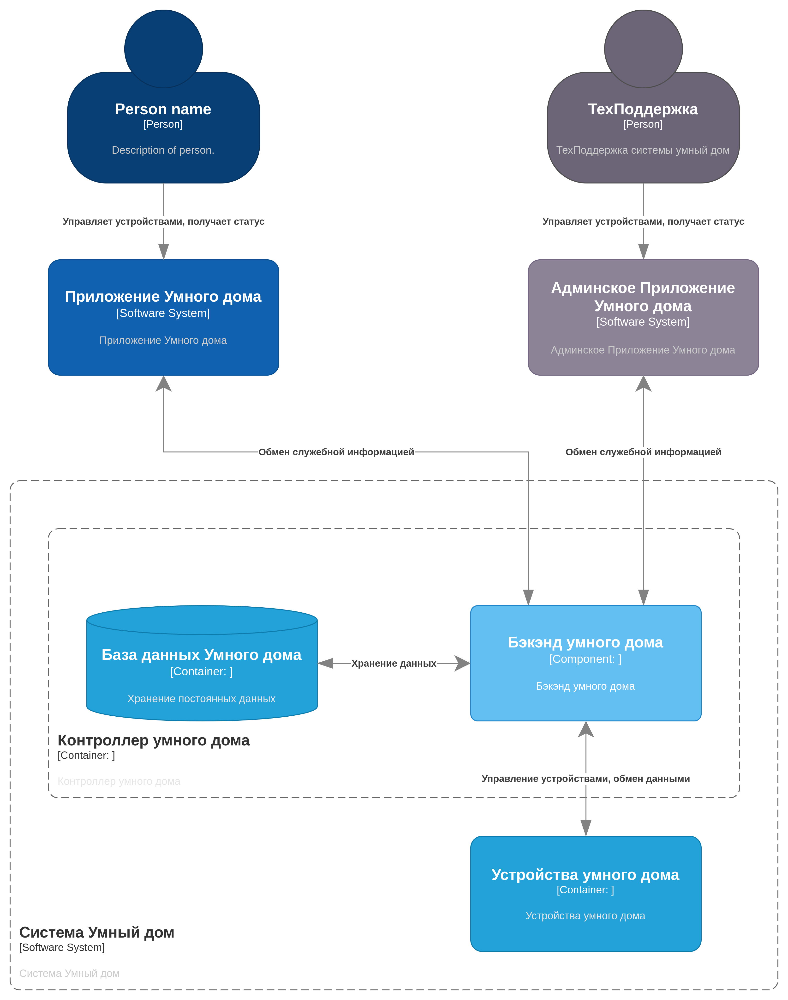
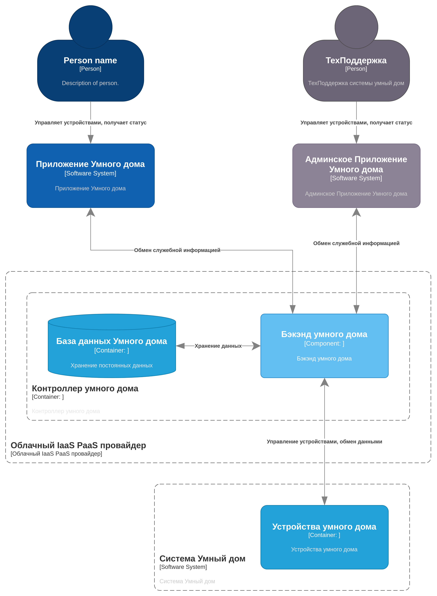

# Архитектурная Ката

## Свет, пожалуйста

Гигант в сфере бытовой электроники хочет создать систему для автоматизации дома: включение и выключение света, запирание и отпирание дверей, удаленное наблюдение с помощью камер и неопределенное поведение в будущем.

- Пользователи: каждая система будет продаваться потребителям (небольшим семьям), но компания рассчитывает продать тысячи таких устройств в течение первых трех лет.
- Требования:
  - система должна быть максимально готова к эксплуатации, но при этом продаваться в модульных блоках (камера, замок, термостат и т. д.) для удобства покупки
  - устройства должны быть доступны через Интернет (для удаленного мониторинга и доступа), и предполагается, что у пользователя будет существующая настройка WiFi (маршрутизатор и подключение) для подключения
  - клиенты могут программировать систему для управления различными модулями в соответствии со своими потребностями.
  - электротехникой для блоков займутся другие группы, а программные протоколы для управления модулями будут гибкими в соответствии с потребностями/проектами вашей архитектуры. (Они займутся реализацией модульной части протокола, как только вы им это укажете.)
- Дополнительный контекст:
  - готов инвестировать большую сумму, чтобы запустить это новое направление бизнеса
  - собирает данные от клиентов, которые согласились собирать более широкую статистику
  - международная компания

## Функциональная декомпозиция

### Вариант 1

В данном варианте компоненты управления элементами умного дома располагаются непосредственно в контуре использования группы устройств.

#### Плюсы решения

Меньше операционные расходы

#### Минусы решения

- Больше капитальные расходы на внедрение.
- Необходимость физического проектирования контроллера и его реализации в виде отдельного функционального блока внутри контура умного дома.
- Обслуживание внутренней инфраструктуры контроллера ложится на плечи пользователя.

#### Сценарии изменения

1. Добавление нового устройства, изменение конфигурации.
    1. Вероятнее всего, по пользовательской инструкции. Не должно составить труда.
2. Добавление нового контроллера, изменение конфигурации.
    1. Вероятнее всего, по пользовательской инструкции. Не должно составить труда.
3. Добавление новой БД, изменение конфигурации.
    1. Вероятнее всего, будет довольно проблематично, так как на момент внедрения размер и расположение БД уже зафиксировано. Изменение БД может привести к замене блока управления системы умного дома.
4. Добавление приложений для использования умного дома, изменение конфигурации.
    1. Вероятнее всего, по пользовательской инструкции. Не должно составить труда.

#### Стоимость изменения

По пунктам 1,2,4 небольшая. По п.3 могут быть значительные капитальные расходы, которые могут быть повторно применены при повторном расширении функционала или БД.

### Вариант 2

В данном варианте компоненты управления элементами умного дома располагаются в контуре внешнего провайдера (в зоне ответственности компании изготовителя).

#### Плюсы решения

- Меньше капитальные расходы на внедрение.
- Большая безопасность за счёт централизации серверов управления, своевременное обновление и устранение уязвимостей.

#### Минусы решения

Больше операционные расходы.

#### Сценарии изменения

1. Добавление нового устройства, изменение конфигурации.
    1. Вероятнее всего, по пользовательской инструкции. Не должно составить труда.
2. Добавление нового контроллера, изменение конфигурации.
    1. Вероятнее всего, по пользовательской инструкции. Не должно составить труда.
3. Добавление новой БД, изменение конфигурации.
    1. Учитывая расположение инфраструктуры в облаке, расширение возможностей контроллера практически не ограничены при должной подготовке.
4. Добавление приложений для использования умного дома, изменение конфигурации.
    1. Вероятнее всего, по пользовательской инструкции. Не должно составить труда.

#### Стоимость изменения

В сравнении с вариантом исполнения 1 различается только пункт 3. Учитывая, что для этого компонента используется внешний IaaS\PaaS, расширение функционала и масштабирование может пройти более гладко как для пользователей, так и для разработчиков решения.

## Вывод

Вариант 2 более выгоден с точки зрения использования, обслуживания и уменьшения капитальных расходов при планировании внедрения.