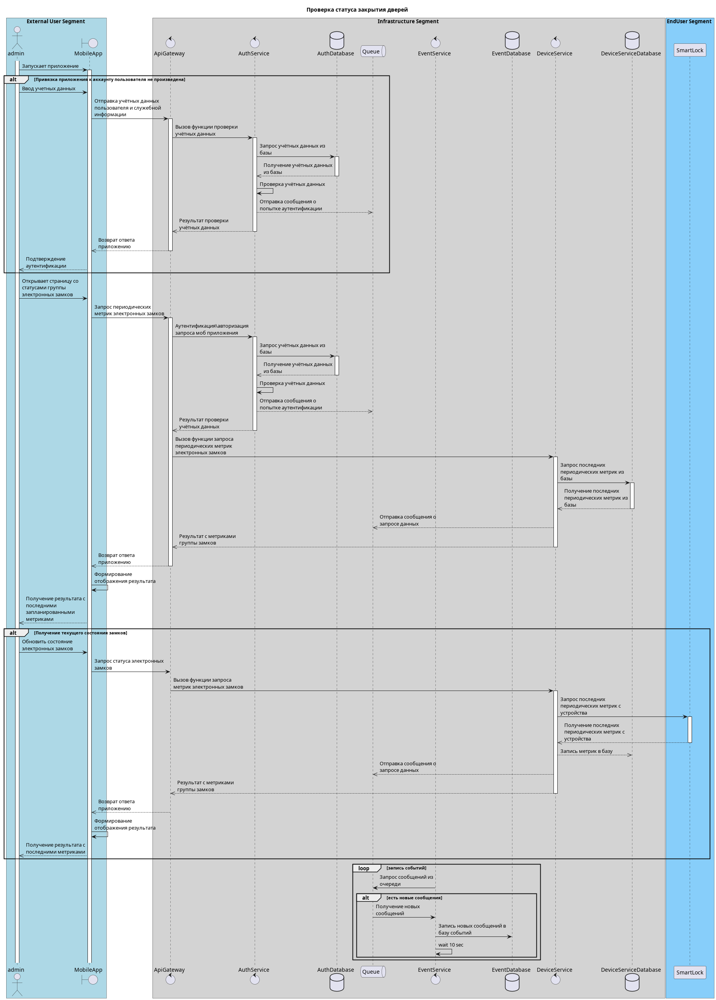

# Архитектурная Ката

## Свет, пожалуйста

Гигант в сфере бытовой электроники хочет создать систему для автоматизации дома: включение и выключение света, запирание и отпирание дверей, удаленное наблюдение с помощью камер и неопределенное поведение в будущем.

- Пользователи: каждая система будет продаваться потребителям (небольшим семьям), но компания рассчитывает продать тысячи таких устройств в течение первых трех лет.
- Требования:
  - система должна быть максимально готова к эксплуатации, но при этом продаваться в модульных блоках (камера, замок, термостат и т. д.) для удобства покупки
  - устройства должны быть доступны через Интернет (для удаленного мониторинга и доступа), и предполагается, что у пользователя будет существующая настройка WiFi (маршрутизатор и подключение) для подключения
  - клиенты могут программировать систему для управления различными модулями в соответствии со своими потребностями.
  - электротехникой для блоков займутся другие группы, а программные протоколы для управления модулями будут гибкими в соответствии с потребностями/проектами вашей архитектуры. (Они займутся реализацией модульной части протокола, как только вы им это укажете.)
- Дополнительный контекст:
  - готов инвестировать большую сумму, чтобы запустить это новое направление бизнеса
  - собирает данные от клиентов, которые согласились собирать более широкую статистику
  - международная компания

## Схема сервисов

## Диаграмма последовательности

## Оценка атрибутов качества.

- доступность / надежность
  - Реализация бизнес-логики в облачном провайдере – плюс к надежности
- модифицируемость
  - Сервис-ориентированный подход – плюс к модифицируемости
  - Паттерн брокер (API-gateway) – плюс к модифицируемости
- производительность
  - Реализация бизнес-логики в облачном провайдере – плюс к производительности
- масштабируемость
  - Сервис-ориентированный подход – возможность гранулярного масштабирования конкретного сервиса
- безопасность
  - Реализация бизнес-логики в облачном провайдере – плюс к безопасности
