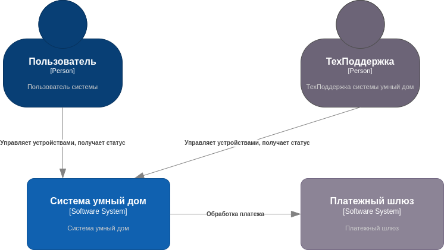
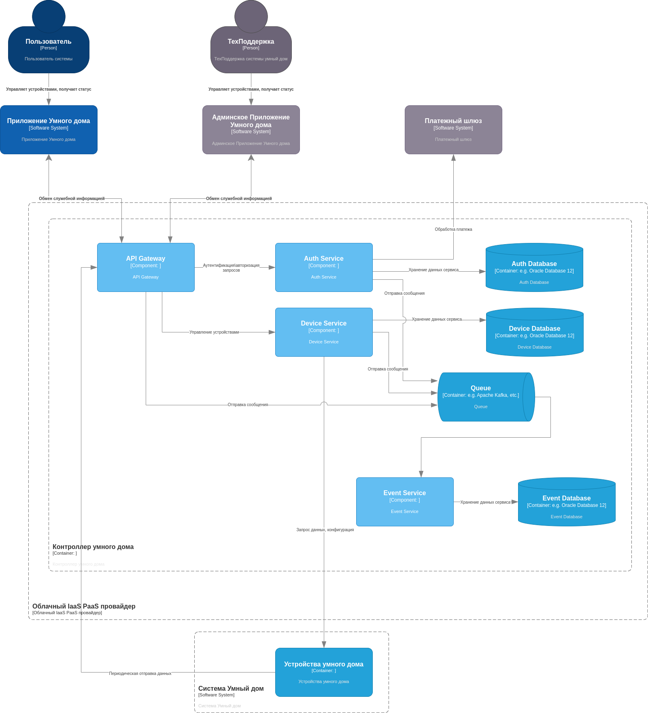
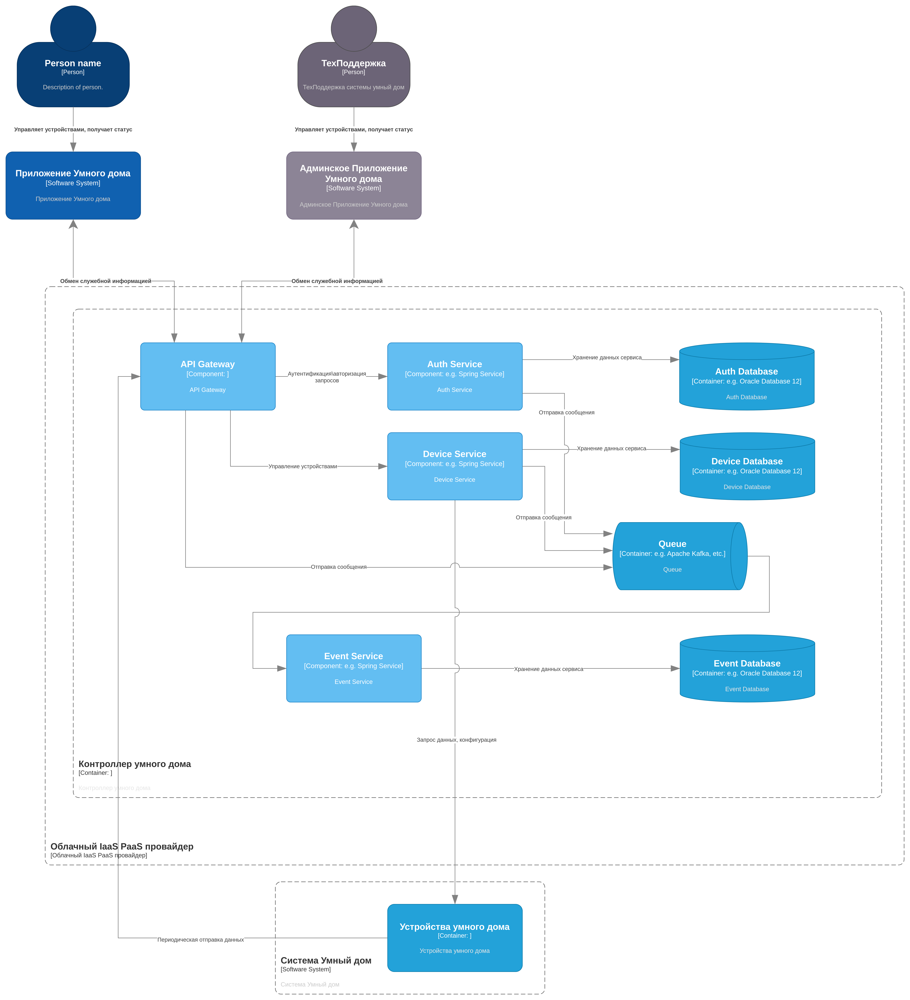
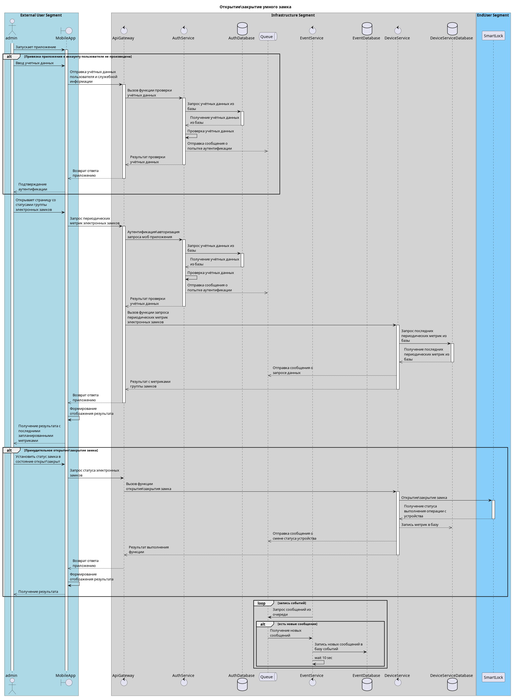
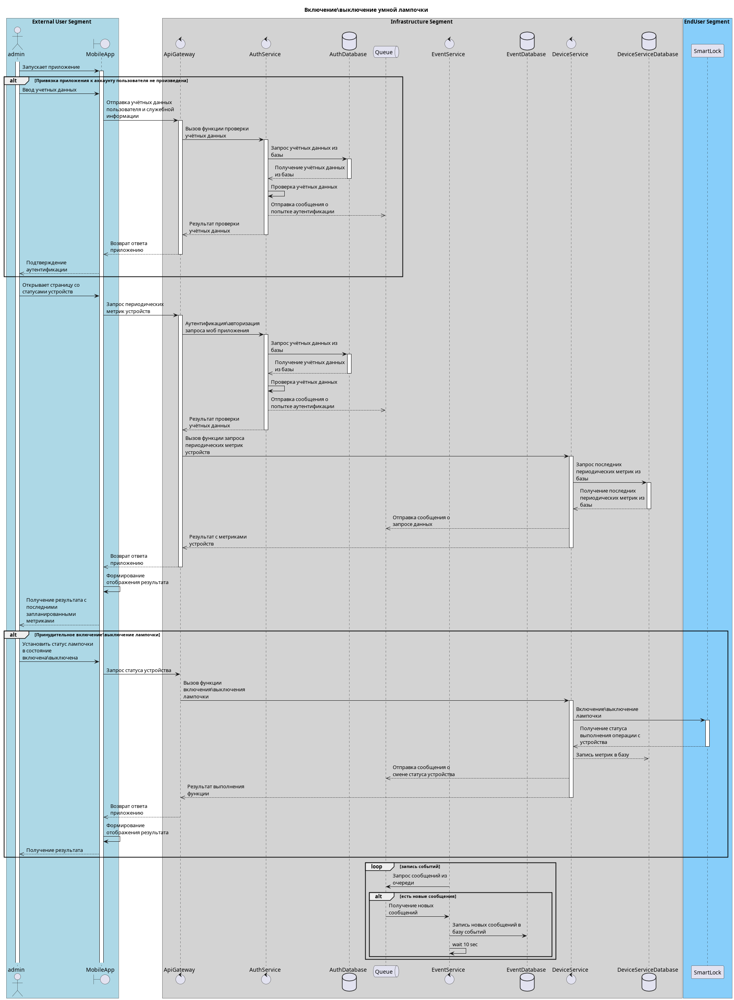

# Проектирование системы управления умным домом

## Архитектурная ката "Свет, пожалуйста". Описание

Гигант в сфере бытовой электроники хочет создать систему для автоматизации дома: включение и выключение света, запирание и отпирание дверей, удаленное наблюдение с помощью камер и неопределенное поведение в будущем.

- Пользователи: каждая система будет продаваться потребителям (небольшим семьям), но компания рассчитывает продать тысячи таких устройств в течение первых трех лет.
- Требования:
  - система должна быть максимально готова к эксплуатации, но при этом продаваться в модульных блоках (камера, замок, термостат и т. д.) для удобства покупки
  - устройства должны быть доступны через Интернет (для удаленного мониторинга и доступа), и предполагается, что у пользователя будет существующая настройка WiFi (маршрутизатор и подключение) для подключения
  - клиенты могут программировать систему для управления различными модулями в соответствии со своими потребностями.
  - электротехникой для блоков займутся другие группы, а программные протоколы для управления модулями будут гибкими в соответствии с потребностями/проектами вашей архитектуры. (Они займутся реализацией модульной части протокола, как только вы им это укажете.)
- Дополнительный контекст:
  - готов инвестировать большую сумму, чтобы запустить это новое направление бизнеса
  - собирает данные от клиентов, которые согласились собирать более широкую статистику
  - международная компания

## Контекст

### Бизнес цели

1. Выход на международный уровень
2. Продажа нескольких тысяч в течение 3 лет

### Архитектурные драйверы

#### Ограничения технологические и бизнесовые
  
1. Доступность для небольших семей

#### Описание требований

1. Пользовательские устройства должны поддерживать работу с Wi-Fi.
2. Пользовательские устройства должны быть следующих типов
   1. Управление дверными замками
   2. Управление освещением
   3. Удаленная видео-аудио съемка
3. Предоставление пользователю по модели SaaS.
   1. Должна быть организована поддержка конечных устройств.
   2. Система управления устройствами должна располагаться на стороне поставщика решения.
   3. Система хранения данных устройств должна располагаться на стороне поставщика решения.
4. Обязательна поддержка сценариев управления

#### Пользовательские сценарии

1. Пользователь должен иметь возможность удалённо включать\выключать свет используя мобильное приложение.
2. Пользователь должен иметь возможность удалённо отпирать\запирать двери используя мобильное приложение.
3. Пользователь должен иметь возможность производить удаленное наблюдение с помощью камер видеонаблюдения используя мобильное приложение.

#### Сценарии для атрибутов качества

1. Система управления сервисом умного дома должна иметь высокую доступность и должна располагаться в инфраструктурном контуре с доступностью 95%
2. Время выполнения запроса от пользователя в сторону устройства умного дома не должно превышать 10 секунд.
3. Время выполнения запроса от пользователя в сторону системы управления сервисом умного дома не должно превышать 2 секунды.

## Описание решения

### Контекстная диаграмма

### Диаграмма контейнеров

### Диаграмма развертывания

### Диаграммы последовательности для пользовательских сценариев

#### Открытие\закрытие умного замка

#### Включение\выключение умной лампочки

### Лог архитектурных решений (ADL, ADR)
